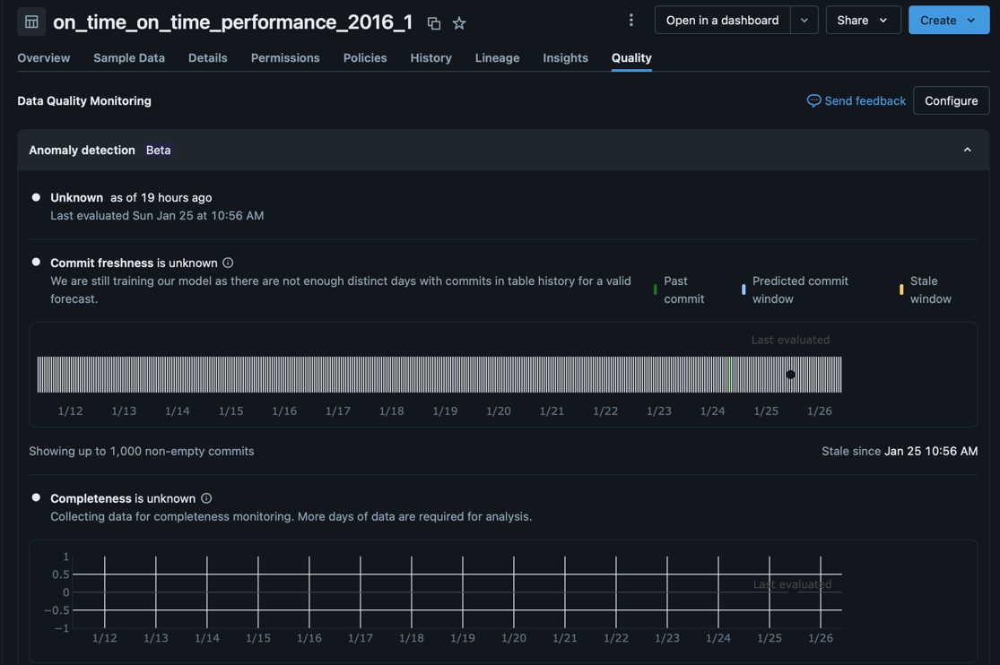
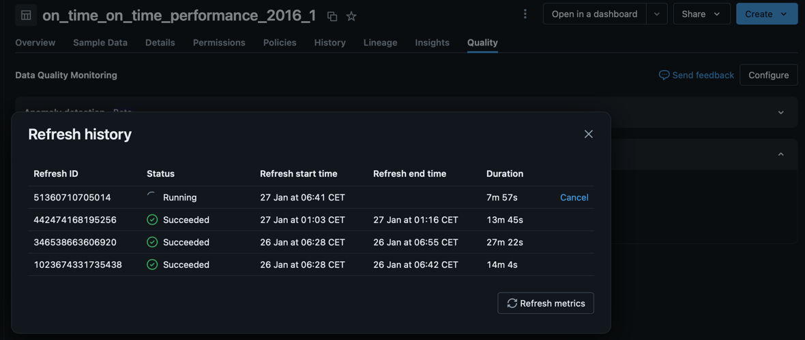
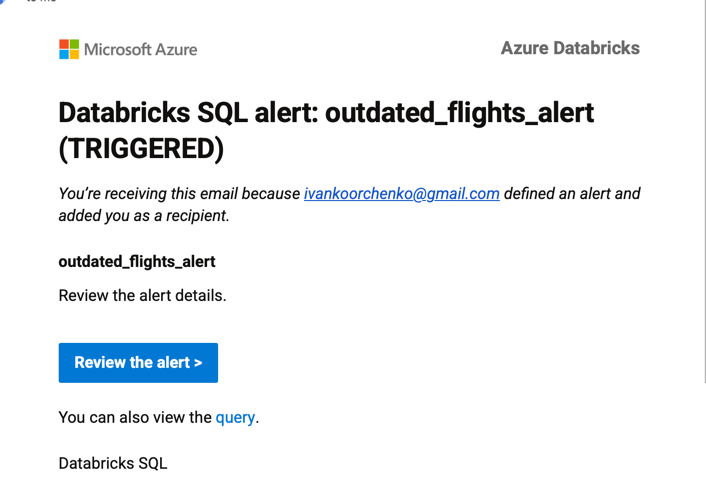

## Data Quality on Databricks

### Introduction
In this blog post, we explore the data quality monitoring tools available on the Databricks platform.
The primary focus is an end-to-end implementation that showcases platform capabilities, including profiling, monitoring, and alerting.

### Data Quality in Databricks
Databricks provides two main capabilities for data quality monitoring:
- **Anomaly detection** – monitoring for all tables in a schema based on learned historical patterns, with alerts triggered on unusual events.
  In particular, this covers data freshness (how long ago a table was updated) and completeness (the proportion of missing data).
- **Data profiling** – a mechanism for calculating a set of table-level metrics, which can then be used to define alerting rules.
  This is a more controlled and incremental approach to data quality monitoring.

We will explore both of these features using the same example.

### Set up the data
To showcase the platform capabilities, we will use the [Airline](https://relational.fel.cvut.cz/dataset/Airline) dataset from the CTU Relational Learning Repository.
This dataset contains US flight data for 2016 and consists of the main `On_Time_On_Time_Performance_2016_1` table along with several dimension tables.

It’s a bit messy, which makes it a perfect fit for this purpose.

First, let’s upload the `On_Time_On_Time_Performance_2016_1` table (flights) into the target Unity Catalog:
```python
from pyspark.sql import SparkSession, DataFrame

JDBC_URL = "jdbc:mysql://relational.fel.cvut.cz:3306/Airline?permitMysqlScheme"
JDBC_USER = "guest"
JDBC_PASSWORD = "ctu-relational"
JDBC_DRIVER = "org.mariadb.jdbc.Driver"

# Catalog and schema names are just examples; make sure to substitute the correct values
UC_CATALOG = "catalog"
UC_SCHEMA = "schema"

spark.sql(f"CREATE CATALOG IF NOT EXISTS {UC_CATALOG}")
spark.sql(f"CREATE SCHEMA IF NOT EXISTS {UC_CATALOG}.{UC_SCHEMA}")

table = "On_Time_On_Time_Performance_2016_1"
full_target = f"{UC_CATALOG}.{UC_SCHEMA}.{table}"

(
    spark.read.format("jdbc")
    .option("url", JDBC_URL)
    .option("dbtable", table)
    .option("user", JDBC_USER)
    .option("password", JDBC_PASSWORD)
    .option("driver", JDBC_DRIVER)
    .load()
    .write
    .mode("overwrite")
    .option("overwriteSchema", "true")
    .saveAsTable(full_target)
)
```
To get a general sense of the data, let’s print a small sample:
```python
df = spark.table(full_target)
print(f"Flights table: columns count: {len(df.columns)}; rows count: {df.count()}")
df.select(df.columns[0:10]).show(10)
```
That produces the following output:
```text
Flights table: columns count: 83; rows count: 445827
+----+-------+-----+----------+---------+----------+-------------+---------+-------+-------+
|Year|Quarter|Month|DayofMonth|DayOfWeek|FlightDate|UniqueCarrier|AirlineID|Carrier|TailNum|
+----+-------+-----+----------+---------+----------+-------------+---------+-------+-------+
|2016|      1|    1|         6|        3|2016-01-06|           AA|    19805|     AA| N4YBAA|
|2016|      1|    1|         7|        4|2016-01-07|           AA|    19805|     AA| N434AA|
|2016|      1|    1|         8|        5|2016-01-08|           AA|    19805|     AA| N541AA|
|2016|      1|    1|         9|        6|2016-01-09|           AA|    19805|     AA| N489AA|
|2016|      1|    1|        10|        7|2016-01-10|           AA|    19805|     AA| N439AA|
|2016|      1|    1|        11|        1|2016-01-11|           AA|    19805|     AA| N468AA|
|2016|      1|    1|        12|        2|2016-01-12|           AA|    19805|     AA| N4YBAA|
|2016|      1|    1|        13|        3|2016-01-13|           AA|    19805|     AA| N569AA|
|2016|      1|      1|        14|        4|2016-01-14|           AA|    19805|     AA| N466AA|
|2016|      1|    1|        15|        5|2016-01-15|           AA|    19805|     AA| N501AA|
+----+-------+-----+----------+---------+----------+-------------+---------+-------+-------+
only showing top 10 rows
```
As you can see, this is a fairly wide and large table containing detailed information about US flights in 2016.

### Anomaly detection
After we have initial data in place now we can create anomaly detection monitoring.
**NOTE**: To make it work enable "Data quality monitoring with anomaly detection (workspace level)" in "Previews" workspaces configuration.

This can be done either manually on the UI or though the following tools:
- Terraform via [databricks_data_quality_monitor Resource](https://registry.terraform.io/providers/databricks/databricks/latest/docs/resources/data_quality_monitor)
- Databricks SDK [data_quality API](https://databricks-sdk-py.readthedocs.io/en/latest/clients/workspace.html#databricks.sdk.WorkspaceClient.data_quality)

For a sake of demonstration simplicity lets' proceed with SDK that is by default installed in a cluster:
```python
from databricks.sdk import WorkspaceClient
from databricks.sdk.service.dataquality import Monitor
from databricks.sdk.service.dataquality import AnomalyDetectionConfig

w = WorkspaceClient()
schema = w.schemas.get(full_name='catalog.schema')

monitor = Monitor(
    object_type='schema',
    object_id=schema.schema_id,
    anomaly_detection_config=AnomalyDetectionConfig()
)
w.data_quality.create_monitor(monitor)
```
After creation, it takes some time for the internal model to learn data patterns. As a result, the initial results are not very informative, since this is only the first run.
You can view the results by opening **Catalog**, selecting your catalog and schema, choosing the `on_time_on_time_performance_2016_1` table, and then navigating to the **Quality** tab in the UI. It should look something like this:


The first meaningful checks will appear after at least 24 hours, once the internal model has learned more about the monitored table.
After this period, the results will be available both in the `system.data_quality_monitoring.table_results` system table and in the UI:


### Data Profiling
As mentioned earlier, Data Profiling is a more controlled mechanism for data quality verification, because you define the quality thresholds yourself.

Databricks supports [three profile types](https://docs.databricks.com/aws/en/data-quality-monitoring/data-profiling/monitor-output#profile-metrics-table-schema), depending on the use case:
- **Time series**: for data with a corresponding timestamp (metrics tracked over time)
- **Snapshot**: for managed tables, external tables, views, etc.
- **Inference**: for tables that contain machine learning model outputs

Since we want to measure quality for a plain Delta table, the **Snapshot** profile type will be our primary focus.

At a high level, monitoring and alerting with Data Profiling looks like this:
#### 1) Create a data profiling monitor
The monitor calculates default and custom metrics per table on a schedule. Default metrics include `min`, `max`, and `percent_null`. A complete list of metrics is available [here](https://docs.databricks.com/aws/en/data-quality-monitoring/data-profiling/monitor-output#profile-metrics-table-schema).

You can create a monitor using one of the following tools:
- Terraform: [`databricks_data_quality_monitor` resource](https://registry.terraform.io/providers/databricks/databricks/latest/docs/resources/data_quality_monitor)
- Asset Bundles: [`quality_monitor`](https://docs.databricks.com/aws/en/dev-tools/bundles/resources#quality_monitor-unity-catalog)
- Databricks SDK: [`data_quality` API](https://docs.databricks.com/aws/en/data-quality-monitoring/data-profiling/create-monitor-api)

After the profiling monitor is created, it will be automatically scheduled for refresh. Each refresh writes results into two tables:
- `{source_table}_profile_metrics`: metrics calculated for the table snapshot at the time of the refresh
- `{source_table}_drift_metrics`: version-over-version drift metrics

#### 2) Create an alert on the profiling results
As with anomaly detection, you need alerts to be notified about data issues. The difference is that alert conditions are based on profiling metrics, so you must decide the metric thresholds.

You can create alerts using one of the following tools:
- Terraform: [`databricks_alert_v2` resource](https://registry.terraform.io/providers/databricks/databricks/latest/docs/resources/alert_v2)
- Asset Bundles: [`alert`](https://docs.databricks.com/aws/en/dev-tools/bundles/resources#alert)
- Databricks SDK: [`alerts_v2` API](https://databricks-sdk-py.readthedocs.io/en/latest/clients/workspace.html#databricks.sdk.WorkspaceClient.alerts_v2)

Now let’s proceed to the implementation. We will create a Snapshot profile with an additional custom metric called `outdated`, which counts the number of dates earlier than 2016, and apply it to the `FlightDate` column.
```python
from databricks.sdk import WorkspaceClient
from databricks.sdk.service.dataquality import (
    Monitor,
    DataProfilingConfig,
    SnapshotConfig,
    DataProfilingStatus,
    RefreshState,
    Refresh,
    DataProfilingCustomMetric,
    DataProfilingCustomMetricType,
    CronSchedule,
)
from pyspark.sql import types as T

w = WorkspaceClient()

catalog_name = "catalog"
schema_name = "airline_raw"
table_name = "on_time_on_time_performance_2016_1"
full_table_name = f"{catalog_name}.{schema_name}.{table_name}"

schema = w.schemas.get(full_name=f"{catalog_name}.{schema_name}")
table = w.tables.get(full_name=f"{catalog_name}.{schema_name}.{table_name}")

table_id = table.table_id
table_object_type = "table"

output_schema_name = "airline_raw_quality"
output_schema = w.schemas.get(full_name=f"{catalog_name}.{output_schema_name}")
output_schema_id = output_schema.schema_id

# Schedule profiling once a day.
schedule = CronSchedule(quartz_cron_expression="0 0 0 * * ?", timezone_id="UTC")

# Custom metric to be added to profile
outdated_metric = DataProfilingCustomMetric(
    type=DataProfilingCustomMetricType.DATA_PROFILING_CUSTOM_METRIC_TYPE_AGGREGATE,
    name="outdated",
    input_columns=["FlightDate"],
    definition="sum(cast(year(`{{input_column}}`) < 2016 as int))",
    output_data_type=T.StructField("outdated", T.IntegerType()).json(),
)

# Profiling monitor
data_profiling_config = DataProfilingConfig(
    output_schema_id=output_schema_id,
    monitored_table_name=full_table_name,
    snapshot=SnapshotConfig(),
    monitor_version=1,
    schedule=schedule,
    custom_metrics=[outdated_metric],
)

monitor = Monitor(
    object_type="table",
    object_id=table.table_id,
    data_profiling_config=data_profiling_config,
)
w.data_quality.create_monitor(monitor)
```

Once the monitor has been created, it schedules the first refresh as soon as possible. You can also trigger a refresh manually via the SDK:
```python
from databricks.sdk import WorkspaceClient
from databricks.sdk.service.dataquality import Refresh

w = WorkspaceClient()

catalog_name = "catalog"
schema_name = "airline_raw"
table_name = "on_time_on_time_performance_2016_1"

schema = w.schemas.get(full_name=f"{catalog_name}.{schema_name}")
table = w.tables.get(full_name=f"{catalog_name}.{schema_name}.{table_name}")

table_id = table.table_id
table_object_type = "table"

w.data_quality.create_refresh(
    object_type=table_object_type,
    object_id=table.table_id,
    refresh=Refresh(
        object_type=table_object_type,
        object_id=table.table_id
    )
)
```

After profiling refresh has been finished, resulting tables can be found in the specified output schema.
For instance, we can query `outdated` custom metric value from the latest profiling result:
```sql
%sql
select window.start, window.end, outdated
from catalog.airline_raw_quality.on_time_on_time_performance_2016_1_profile_metrics
where column_name = 'FlightDate'
order by window.end desc
limit 1
```
So far this query is supposed to return `0` for the latest refresh. To monitor the metric values does not exceeds `0`
threshold we need to create a dedicated SQL Alert:
```python
import time

from databricks.sdk import WorkspaceClient
from databricks.sdk.service.sql import (
    AlertCondition,
    AlertEvaluationState,
    AlertV2,
    AlertV2Evaluation,
    AlertV2Notification,
    AlertV2Operand,
    AlertV2OperandColumn,
    AlertV2OperandValue,
    AlertV2Subscription,
    ComparisonOperator,
    CronSchedule,
)

w = WorkspaceClient()

# Choose the first Warehouse in your workspace
warehouses = list(w.warehouses.list())
warehouse_id = warehouses[0].id

# Query latest `outdated` metric value
query_text = """
select outdated
from catalog.airline_raw_quality.on_time_on_time_performance_2016_1_profile_metrics
where column_name = 'FlightDate'
order by window.end desc
limit 1
"""

# Create an alert to trigger once `outdated` metric value is greater than 0 
evaluation = AlertV2Evaluation(
    source=AlertV2OperandColumn(name="outdated"),
    comparison_operator=ComparisonOperator.GREATER_THAN,
    threshold=AlertV2Operand(
        value=AlertV2OperandValue(double_value=0)
    ),
    empty_result_state=AlertEvaluationState.ERROR,
    notification=AlertV2Notification(
        notify_on_ok=True,
        subscriptions=[
            AlertV2Subscription(user_email="username@email.com") # example email
        ],
    )
)

# Schedule the alert to run daily
schedule = CronSchedule(
    quartz_cron_schedule="0 0 0 * * ?",
    timezone_id="UTC",
)

alert_config = AlertV2(
    warehouse_id=warehouse_id,
    display_name="outdated_flights_alert",
    query_text=query_text,
    evaluation=evaluation,
    schedule=schedule,
)

w.alerts_v2.create_alert(alert=alert_config)
```

For the sake of demonstration, let’s intentionally pollute the monitored table.
To do this, we will insert 10 rows from the original dataset, but with the `FlightDate` column replaced by January 1, 2015:
```python
from pyspark.sql import functions as F

full_table_name = f"catalog.airline_raw.on_time_on_time_performance_2016_1"

(
    spark
    .table(full_table_name)
    .where(F.year(F.col("FlightDate")) == 2016)
    .limit(10)
    .drop("FlightDate")
    .withColumn("FlightDate", F.to_date(F.lit("2015-01-01")))
    .write
    .mode("append")
    .saveAsTable(full_table_name)
)
```
With this change in place, we need to trigger a monitor refresh. You can do this via automation tooling, or from the UI:
`Unity Catalog -> {table} -> Quality tab -> Data Profiling -> View Refresh History -> Refresh Metrics`



Once the metrics are refreshed, the alert must run to evaluate the new results and raise an issue if the threshold is breached.
After the alert runs, a notification is sent (in this example, an email):


### Alerts
Although Data Profiling is a powerful tool for data quality monitoring, it may not be sufficient to cover more complex cases, such as:
- foreign key integrity checks across two or more tables
- duplicate rate thresholds across multiple columns

These scenarios can be addressed using plain SQL queries combined with Databricks Alerts.

### Notes
In conclusion, here are a couple of points to keep in mind if you are considering these platform tools for implementation:
- They rely on SQL warehouses, which are generally more expensive than all-purpose compute.
- Tooling is not always fully aligned: anomaly detection monitors cannot currently be created via Asset Bundles, while the other components can.

### References
Bellow is the list of other sources used to write this post:
- https://iso25000.com/index.php/en/iso-25000-standards/iso-25012
- https://arxiv.org/pdf/2102.11527
- https://medium.com/the-thoughtful-engineer/part-5-iso-25012-in-action-what-data-quality-really-means-5e334b828595
- https://www.ibm.com/think/topics/data-reconciliation

Databricks documentation: 
- [Anomaly detection](https://docs.databricks.com/aws/en/data-quality-monitoring/anomaly-detection/)
- [Data profiling](https://docs.databricks.com/aws/en/data-quality-monitoring/data-profiling/)
- [Data profiling: Profiling tables](https://docs.databricks.com/aws/en/data-quality-monitoring/data-profiling/monitor-output)
- [Data profiling: custom metrics example](https://docs.databricks.com/aws/en/data-quality-monitoring/data-profiling/custom-metrics#aggregate-metric-example)
- [Data profiling: using the API](https://databricks-sdk-py.readthedocs.io/en/latest/clients/workspace.html#databricks.sdk.WorkspaceClient.data_quality)
- [Query data](https://docs.databricks.com/aws/en/query/)
- [Databricks SQL Alerts](https://docs.databricks.com/aws/en/sql/user/alerts/)
- [Data and AI Governance book](https://www.databricks.com/resources/ebook/data-analytics-and-ai-governance)